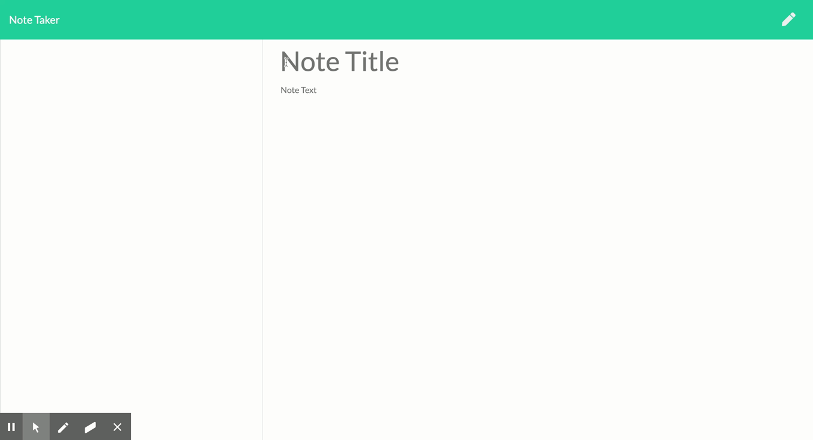

# Note-Taker
 

## Description
 A program that allows to to create notes

## Table of Contents

* [Installation](#installation)
* [Usage](#usage)
* [Contact Me](#contact-me)

## Installation
(A live version of this program is provided at https://nameless-brushlands-18109.herokuapp.com/) 
Download NPM by going to the project folder in terminal then running 'npm init -y' followed by 'npm i express'

## Usage

To run type 'npm start' into terminal while in the project folder then go tohttp://localhost:3001/ in your browser.

## Tests
Here is a demonstration of the program:
 

## License

© Joshua Price
Licensed under the MIT License license.

## Contact Me

If you have any questions about my project you can reach me by email at joshuaprice315@gmail.com
You can also view more of my projects at https://github.com/JoshPrice315
